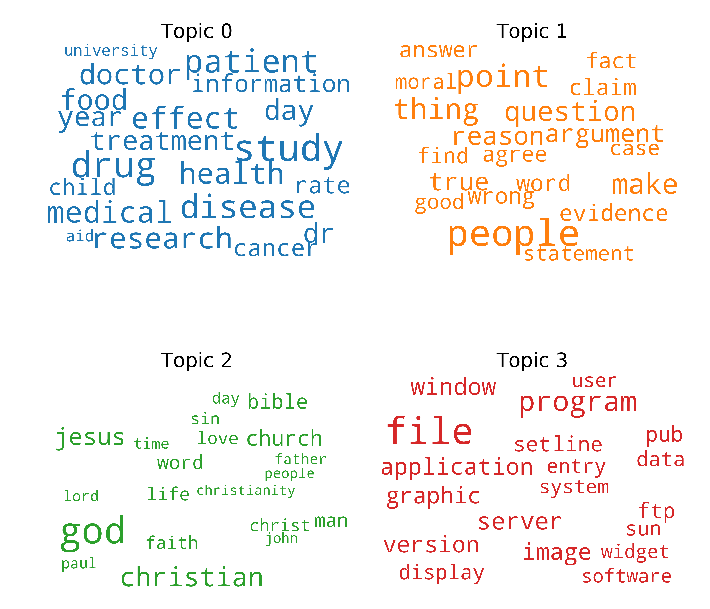

# Topics and Summary

## What is it?

**topics_and_summary** is a library that **identifies topics** in a collection of text documents and **classifies** the documents inside that topics. It also **generates summaries** of text documents. This is done using NLP techniques.

## Main Features
* **Identify the topics present in the collection of documents.**
* **Identify the relation of each document in the collection with each topic.**
* **Classify each document in the collection inside a topic.**
* **Identify the relation of a given text document with each topic.**
* **Classify a given text document inside a topic.**
* **Obtain the most representative documents of each topic.**
* **Obtain the documents of the collection more related with a given text document.**
* **Create an extractive summary of a given text document.**

## Dependencies, Installation and Usage
All this information and more is present in the **documentation**.
